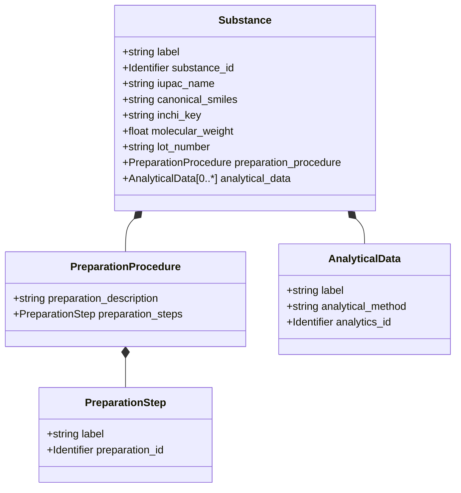

```mermaid
classDiagram
    Substance *-- PreparationProcedure
    Substance *-- AnalyticalData
    PreparationProcedure *-- PreparationStep
    
    class Substance {
        +string label
        +Identifier substance_id
        +string iupac_name
        +string canonical_smiles
        +string inchi_key
        +float molecular_weight
        +string lot_number
        +PreparationProcedure preparation_procedure
        +AnalyticalData[0..*] analytical_data
    }
    
    class PreparationProcedure {
        +string preparation_description
        +PreparationStep preparation_steps
    }
    
    class PreparationStep {
        +string label
        +Identifier preparation_id
    }
    
    class AnalyticalData {
        +string label
        +string analytical_method
        +Identifier analytics_id
    }
    
```